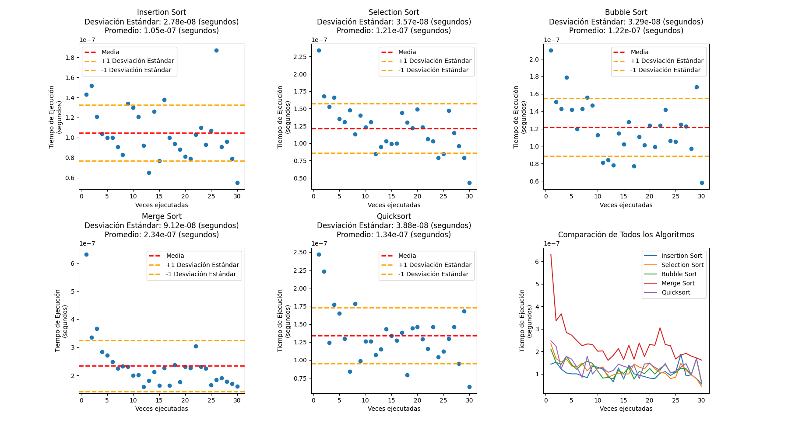
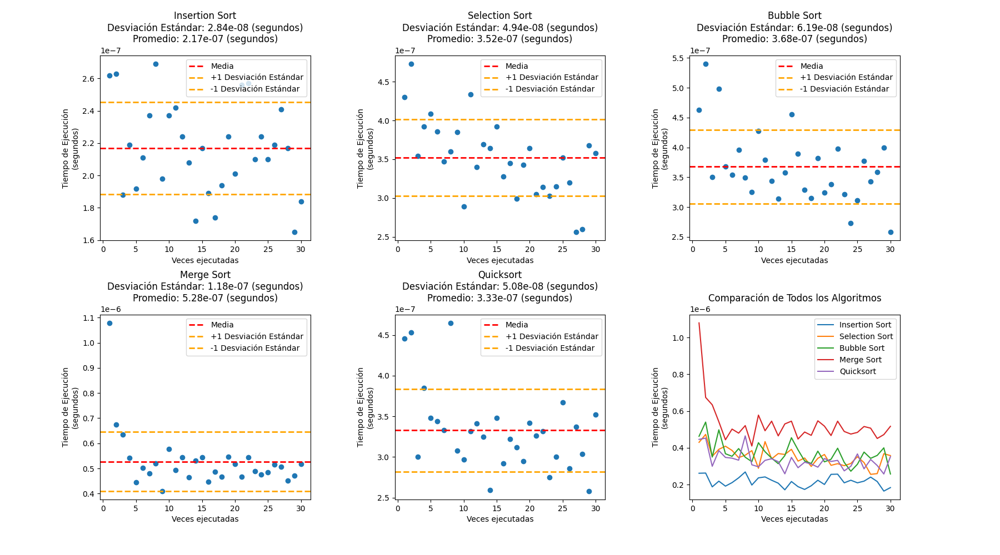
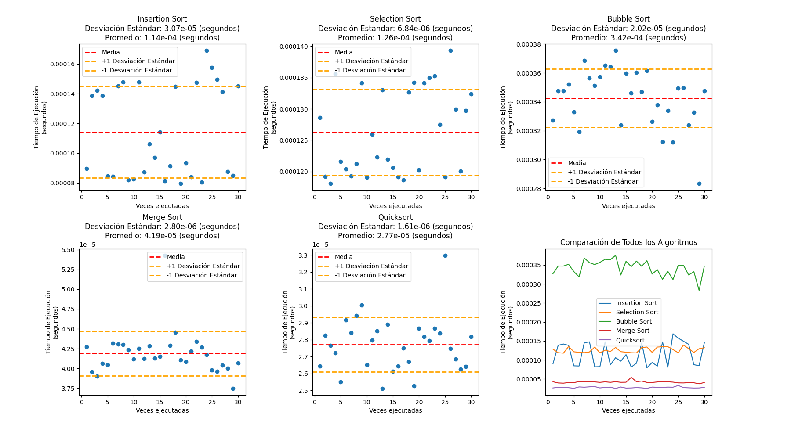
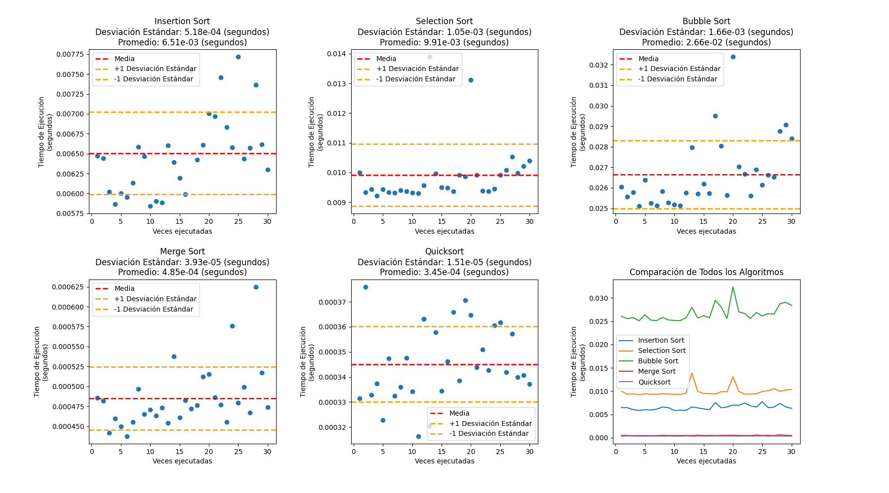
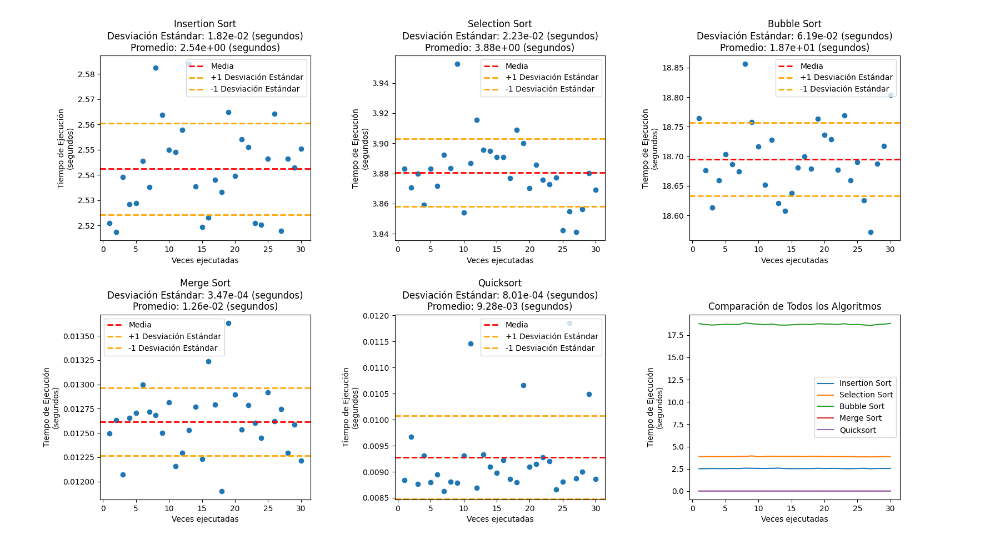
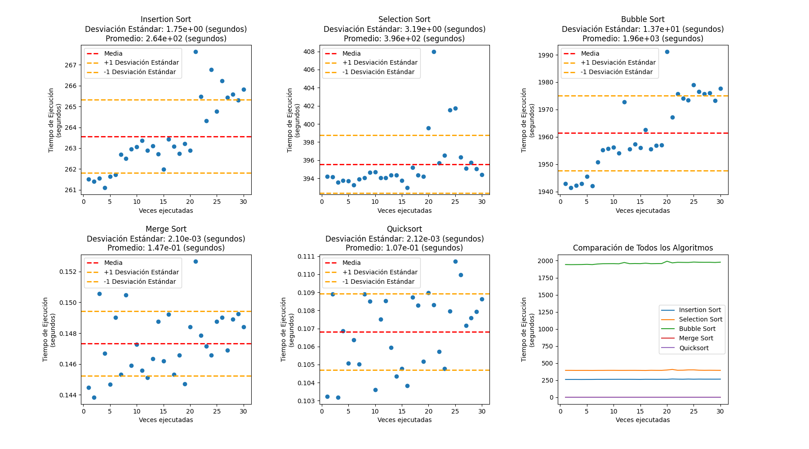

# Práctica 4: Algoritmos de ordenamiento

En esta práctica se pondrá a prueba los algoritmos de ordenamiento **Merge sort, Insertion Sort, Bubble sort, Quick sort y Selection sort**, para ver su nivel de eficiente dependiendo del tamaño a ordenar, esto para saber en que momento podemos usar algun metodo de estos para lograr un ordenamiento más eficiente.

## Tablas de promedio y desviación estandar

### Tabla de desviación estandar
|          n |       IS |       SS |        BS |       MS |       QS |
|-----------:|---------:|---------:|----------:|---------:|---------:|
|      5     | 2.78e-08 | 3.57e-08 |  3.29e-08 | 9.12e-08 | 3.88e-08 |
|     10     | 2.84e-08 | 4.94e-08 |  6.19e-08 | 1.18e-07 | 5.08e-08 |
|     50     | 3.53e-07 | 4.56e-07 |  5.06e-07 | 2.74e-07 | 1.97e-07 |
|    100     | 1.18e-06 | 1.1e-06  |  1.65e-06 | 3.03e-07 | 3.75e-07 |
|    500     | 3.07e-05 | 6.84e-06 |  2.02e-05 | 2.8e-06  | 1.61e-06 |
|   1000     | 9.38e-05 | 2.84e-05 |  9.3e-05  | 4.26e-06 | 2.46e-06 |
|   5000     | 0.000518 | 0.00105  |  0.00166  | 3.93e-05 | 1.51e-05 |
|  10000     | 0.00154  | 0.000984 |  0.00277  | 7.03e-05 | 4.41e-05 |
|  50000     | 0.00691  | 0.00964  |  0.0362   | 0.000242 | 0.000134 |
| 100000     | 0.0182   | 0.0223   |  0.0619   | 0.000347 | 0.000801 |
| 500000     | 0.361    | 0.368    |  2.13     | 0.0019   | 0.00112  |
|      1e+06 | 1.75     | 3.19     | 13.7      | 0.0021   | 0.00212  |

**1. Desempeño Relativo**:

        Los algoritmos muestran variabilidad en su desempeño relativo en términos de desviación estándar. Por ejemplo, para n=5, Quicksort (QS) tiene una desviación estándar significativamente más baja que los demás.

**2. Tamaño de Muestra Impacta en el Rendimiento:**

        La desviación estándar tiende a disminuir a medida que el tamaño de muestra aumenta para algunos algoritmos. Por ejemplo, para Merge Sort (MS), la desviación estándar disminuye de 2.74e-07 (n=50) a 4.26e-06 (n=1000).

**2. Comparación entre Algoritmos:**

        En general, Quicksort (QS) muestra desviaciones estándar más bajas en comparación con otros algoritmos en varios tamaños de muestra. Bubble Sort (BS) tiende a tener desviaciones estándar más altas.

**3. Identificación de Algoritmos Robustos:**

        Quicksort (QS) podría considerarse más robusto, ya que tiene desviaciones estándar consistentemente bajas en comparación con otros algoritmos.

**4. Tendencias Generales:**

        Para algunos algoritmos, como Merge Sort (MS) y QuickSort (QS), la desviación estándar tiende a estabilizarse o disminuir a medida que el tamaño de muestra aumenta.

**5. Identificación de Puntos de Quiebre:**

        No hay puntos de quiebre evidentes en los que la desviación estándar aumente drásticamente para un tamaño de muestra específico en esta tabla.

**6. Consideraciones Prácticas:**

        Aunque Quicksort (QS) parece ser el algoritmo más consistente en este conjunto de datos, la elección del algoritmo debe considerar otros factores prácticos, como la complejidad temporal y espacial, dependiendo del contexto de uso.

---
### Tabla de promedio
|          n |         IS |         SS |          BS |       MS |       QS |
|-----------:|-----------:|-----------:|------------:|---------:|---------:|
|      5     |   1.05e-07 |   1.21e-07 |    1.22e-07 | 2.34e-07 | 1.34e-07 |
|     10     |   2.17e-07 |   3.52e-07 |    3.68e-07 | 5.28e-07 | 3.33e-07 |
|     50     |   1.61e-06 |   2.99e-06 |    5.52e-06 | 3.39e-06 | 1.99e-06 |
|    100     |   5.86e-06 |   8.85e-06 |    1.86e-05 | 7.37e-06 | 4.36e-06 |
|    500     |   0.000114 |   0.000126 |    0.000342 | 4.19e-05 | 2.77e-05 |
|   1000     |   0.000348 |   0.00043  |    0.00113  | 8.21e-05 | 5.68e-05 |
|   5000     |   0.00651  |   0.00991  |    0.0266   | 0.000485 | 0.000345 |
|  10000     |   0.0249   |   0.0384   |    0.119    | 0.00102  | 0.000745 |
|  50000     |   0.624    |   0.978    |    4.5      | 0.00594  | 0.00422  |
| 100000     |   2.54     |   3.88     |   18.7      | 0.0126   | 0.00928  |
| 500000     |  63.8      |  98.3      |  483        | 0.0705   | 0.0505   |
|      1e+06 | 264        | 396        | 1960        | 0.147    | 0.107    |

**1. Comparación de Rendimiento:**

        En términos generales, se puede observar que los tiempos promedio de ejecución varían para cada algoritmo en función del tamaño de la muestra (n).
        Quicksort (QS) sigue siendo generalmente más rápido en comparación con los demás algoritmos.
Efecto del Tamaño de Muestra:

A medida que el tamaño de la muestra aumenta, los tiempos de ejecución promedio también aumentan para todos los algoritmos. Esto es esperado, ya que el tiempo de ejecución suele depender del tamaño de la entrada.
Identificación de Algoritmos Eficientes:

Quicksort (QS) continúa mostrando tiempos de ejecución promedio más bajos en comparación con los demás algoritmos en todos los tamaños de muestra.
Bubble Sort (BS) tiende a tener tiempos de ejecución más altos, especialmente a medida que el tamaño de la muestra aumenta.
Comparación con Desviación Estándar:

Puedes comparar estos resultados con la tabla de desviación estándar para obtener una comprensión completa del rendimiento y la consistencia de cada algoritmo.
Consideraciones Prácticas:

Aunque Quicksort (QS) muestra tiempos de ejecución promedio más bajos, es importante considerar otros factores, como la complejidad temporal y espacial, así como el comportamiento en escenarios específicos.

# Ejecución del programa

Al hacer la ejecución de los diversos algoritmos de ordenamiento, nos podemos dar cuenta que con arreglos pequeños, es bastante eficiente el algoritmo **Insertion Sort**, y el algoritmo **Merge Sort** es el menos eficiente de los 5 algoritmos.

### 5 Repeticiones

Al ir aumentando el tamaño del arreglo se empezaron a notar cambios en la eficiencia de los algoritmos:
---
### 10 Repeticiones

---
### 50 Repeticiones

Al hacer el arreglo de tamaño 50 observamos que **Bubble sort** se empiza a alejar de los demás algoritmos, mientras **Merge sort** empieza a acercarse más a los demás, mientras **Insertion sort** se mantiene como el más eficiente.

### 100 Repeticiones

Cuando llegamos a un arreglo de tamaño 100 a **Insertion sort** le comienza a pesar un poco el trabajo, en cambio **Quicksort** se posiciona como el más eficiente mientras **Merge sort** va mejorando en tiempo.

### 500 Repeticiones

Al llegar a un tamaño de 500 es clara la diferencia entre cada algoritmo, poniendo a **Bubble sort** como el menos eficiente, después **Selection sort** e **Insertion sort**, y como los mejores tenemos a **Merge Sort** y **Quicksort** 

A partir del tamaño 500, la brecha se hace más corta entre **Merge Sort** y **Quicksort**, mientras se nota más la diferencia entre **Insertion sort** y **Selection sort**, en donde al final queda **Bubble sort**.

### 5,000 Repeticiones

---
### 100,000 Repeticiones

Al seguir avanzando, ya no vemos diferencia entre cual algoritmo es más efectivo, por lo que ya sabemos y podemos ver que **Merge sort** y **Quicksort** son más eficientes para tamaños muy grandes, mientras **Bubble sort** no nos ayuda para estos casos.

### 1,000,000 Repeticiones

Pero en caso contrario, al tener tamaños muy pequeños (menores a 10), **Bubble sort** se posiciona como uno de los más eficientes, seguido de **Insertion sort**.

El algoritmo que podriamos decir que sería el más eficiente sin importar el tamaño, sería el **Quick sort**, ya que se mantiene con una velocidad rápida en comparación con los demás en todos los casos.

## Conclusiones

Esta practica funcionó para darnos cuenta que los diferentes algoritmos de ordenamiento tienen distintos usos, dependiendo del tamaño a ordenar, unos pueden ser mejor que otros, en general vimos que el **Bubble sort** no nos ayuda en tamaños mayores a 10, y si queremos mayor velocidad en tamaños grandes recurramos al uso de **Merge sort y Quicksort**, lo que nos indica que los algoritmos recursivos nos funcionan mejor que los iterativos en tamaños grandes en cambio, los iterativos son "mejores" en tamaños pequeños.

---
### Nota:
Las tablas de cada ejecución se podrán encontrar en la ruta `./analisis/csv`, en esta carpeta encontraras las tablas de tiempos de ejecución del programa desde el tamaño 5 hasta el tamaño 1,000,000.